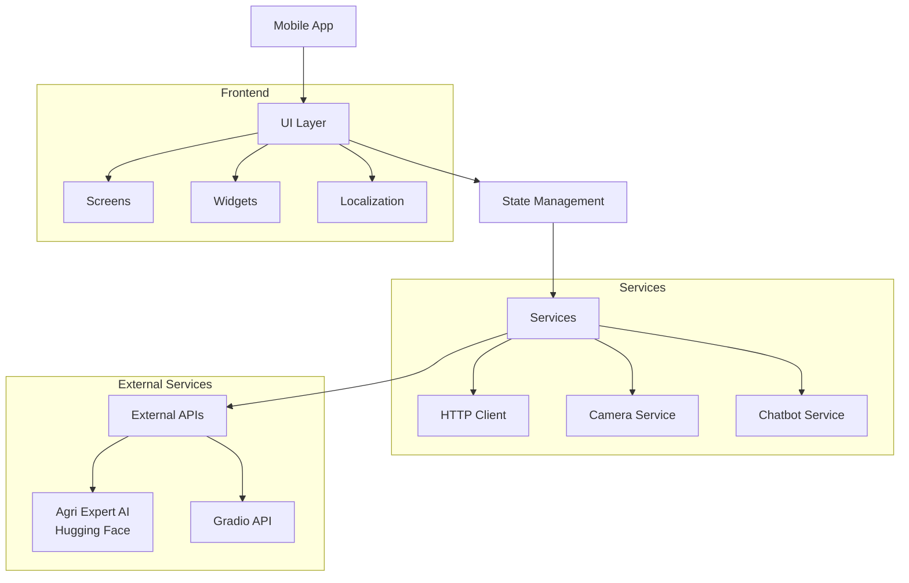
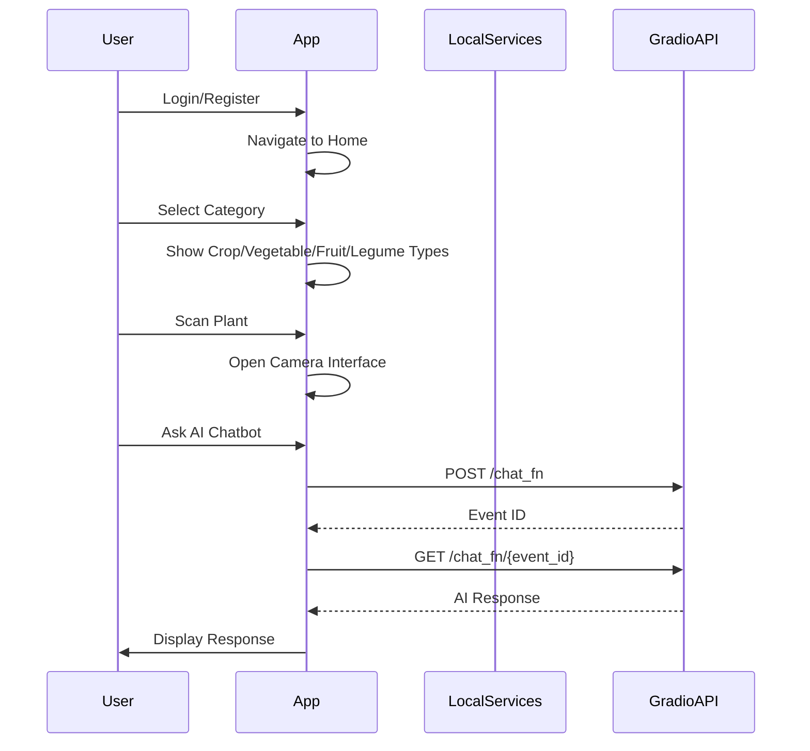

# 🚀 AgroSense

<!-- Logo placeholder -->
<p align="center">
  
</p>

<p align="center">
  <strong>Smart Plant Assistant & Crop Scanner</strong>
</p>

<p align="center">
  🌿 Your AI-powered companion for plant identification, crop scanning, and agricultural guidance
</p>

<p align="center">
  <a href="https://github.com/Zeyad-GenAI/AgroSense/releases">
    
  </a>
  <a href="https://flutter.dev">
    
  </a>
  <a href="https://dart.dev">
    
  </a>
  <a href="https://opensource.org/licenses/MIT">
    
  </a>
</p>

---

## 📱 Project Overview

**AgroSense** is a comprehensive Flutter-based mobile application designed to empower farmers, gardeners, and agricultural enthusiasts with AI-driven plant analysis and expert guidance. The app combines cutting-edge computer vision technology with an intelligent chatbot to provide real-time plant identification, crop health scanning, and personalized care instructions.

### 🔍 Problem It Solves

- **Limited Access to Agricultural Expertise**: Farmers and gardeners often lack access to expert advice for plant care and disease identification
- **Language Barriers**: Agricultural information is predominantly available in English, creating barriers for Arabic-speaking communities
- **Time-Consuming Research**: Finding specific information about crops, vegetables, and fruits requires extensive searching
- **Plant Disease Recognition**: Early detection of plant diseases is crucial for preventing crop loss

### 🎯 Target Users

- **Farmers & Agricultural Workers**: Seeking quick plant/crop identification and health assessment
- **Home Gardeners**: Looking for guidance on plant care and seasonal tips
- **Agriculture Students**: Learning about different crop types and farming practices
- **Botany Enthusiasts**: Exploring plant species identification

---

## 🏗️ Architecture Overview



### 📊 Application Flow



---

## ✨ Key Features

### 🎯 Core Features

| Category | Features |
|----------|----------|
| **Plant Analysis** | 🌱 Plant photo upload, 📷 Camera capture, 📝 Note attachment |
| **Crop Scanning** | 🌾 Crops, 🥕 Vegetables, 🍎 Fruits, 🫘 Legumes categorization |
| **AI Chatbot** | 🤖 Intelligent Q&A with agricultural expertise, 💬 Quick reply suggestions |
| **Seasonal Tips** | 🌾 Rice, 🌾 Wheat, 🍅 Tomatoes growing guidance |
| **Localization** | 🌐 Full English and Arabic support with RTL layout |

### 🔐 Authentication Features

- ✉️ Email/Password login with validation
- 📝 Account registration with secure password creation
- 🔵 Google Sign-In integration ready
- 🔄 Password recovery flow (3-step process)
- 🛡️ Session management with navigation guards

### 🏠 Dashboard Features

- 📍 Location-based header display
- 🔍 Search functionality for plants
- ⭐ Premium feature promotion banner
- 📋 Category grid with images:
  - 🌾 Crops (Rice, Wheat, Barley)
  - 🥕 Vegetables (Potatoes, Cucumber, Tomatoes)
  - 🍎 Fruits (Banana, Apples)
  - 🫘 Legumes (Bean)
- 📅 Seasonal tips carousel
- 🔽 Bottom navigation bar

### 👤 Profile & Settings

- 👨‍💼 User profile display
- 🌐 Language switching (English/Arabic)
- 🔔 Notification preferences management
- ⚙️ Account management options:
  - ✏️ Edit Profile
  - 🔑 Change Password
  - 📧 Change Email
  - 🗑️ Delete Account

---

## 🛠️ Tech Stack

| Category | Technologies |
|----------|--------------|
| **Framework** | Flutter 3.7+ |
| **Language** | Dart |
| **State Management** | StatefulWidget with Listener pattern |
| **HTTP Client** | http ^1.2.0 |
| **Web Integration** | webview_flutter ^4.7.0 |
| **Icons** | cupertino_icons ^1.0.8 |
| **Platforms** | Android, iOS, Web, Linux, macOS, Windows |

### 🏛️ Architecture Pattern

```
lib/
├── main.dart                    # App entry point & routing
├── localization_service.dart    # i18n service (EN/AR)
├── screens/                     # Main application screens
│   ├── splash_screen.dart
│   ├── onboarding_screen.dart
│   ├── welcome_page.dart
│   ├── login_screen.dart
│   ├── sign_up_screen.dart
│   ├── home_screen.dart
│   ├── profile_screen.dart
│   ├── account_screen.dart
│   ├── forget_password_screen.dart
│   ├── forget_password_two.dart
│   ├── forget_password_three.dart
│   └── tip_details_screen.dart
├── new screens/                 # Additional feature screens
│   ├── chatbot_screen.dart      # AI agricultural assistant
│   ├── web_chat_screen.dart
│   ├── farming_tips_screen.dart
│   ├── seasons_screen.dart
│   ├── plant_photo_upload_screen.dart
│   └── general_camera_screen.dart
└── scan screen/                  # Plant scanning screens
    ├── category_types_screen.dart
    ├── crops_scan_screen.dart
    ├── vegetables_scan_screen.dart
    ├── fruits_scan_screen.dart
    └── legumes_scan_screen.dart
```

---

## 📦 Dependencies Analysis

### 🔧 Core Dependencies

| Package | Version | Purpose |
|---------|---------|---------|
| `flutter` | SDK | Cross-platform framework |
| `http` | ^1.2.0 | HTTP client for API communication |
| `webview_flutter` | ^4.7.0 | Web content integration |
| `cupertino_icons` | ^1.0.8 | iOS-style icons |

### 🧪 Dev Dependencies

| Package | Version | Purpose |
|---------|---------|---------|
| `flutter_test` | SDK | Unit & widget testing |
| `flutter_lints` | ^5.0.0 | Code quality linting |

### 🤖 AI Integration

The app integrates with a Gradio-powered AI model hosted on Hugging Face Spaces:

```dart
// Endpoint: https://zed344-agri-expert.hf.space
// Method: Two-step Gradio 4.x API flow
// 1. POST request to /gradio_api/call/chat_fn
// 2. GET request to /gradio_api/call/chat_fn/{event_id}
```

---

## 📁 Repository Structure

```bash
AgroSense/
├── .github/
│   └── workflows/              # GitHub Actions CI/CD
├── android/                    # Android platform configuration
├── assets/
│   └── images/                 # App images & icons
├── ios/                         # iOS platform configuration
├── lib/                         # Dart/Flutter source code
├── linux/                      # Linux desktop configuration
├── macos/                      # macOS desktop configuration
├── test/                       # Unit & widget tests
├── web/                        # Web platform configuration
├── windows/                    # Windows desktop configuration
├── .flutter-plugins            # Flutter plugin registry
├── .gitignore                  # Git ignore rules
├── .metadata                   # Flutter metadata
├── analysis_options.yaml        # Dart analysis configuration
├── pubspec.lock                # Dependency lock file
├── pubspec.yaml                # Pub package configuration
└── README.md                   # This file
```

---

## ⚙️ Installation & Setup

### 📋 Prerequisites

- Flutter SDK 3.7.0 or higher
- Dart SDK 3.0.0 or higher
- Android Studio / VS Code with Flutter extensions
- Git

### 🔧 Clone & Install

```bash
# Clone the repository
git clone https://github.com/Zeyad-GenAI/AgroSense.git

# Navigate to project directory
cd AgroSense

# Install dependencies
flutter pub get

# Get dependencies
flutter pub upgrade --major-versions
```

### 🖥️ Running the App_locally

```bash
# Run on Android (connected device or emulator)
flutter run -d android

# Run on iOS Simulator (macOS only)
flutter run -d ios

# Run on Web
flutter run -d chrome

# Run on Linux Desktop
flutter run -d linux

# Run in debug mode with hot reload
flutter run
```

### 📦 Building for Production

```bash
# Build Android APK (release)
flutter build apk --release

# Build Android App Bundle
flutter build appbundle --release

# Build iOS (requires macOS)
flutter build ios --release

# Build Web
flutter build web
```

---

## 🌐 Environment Variables

Create a `.env` file (if needed for production):

```env
# API Configuration
API_BASE_URL=https://zed344-agri-expert.hf.space
API_TIMEOUT=120

# App Configuration
APP_NAME=AgroSense
SUPPORTED_LANGUAGES=en,ar
DEFAULT_LANGUAGE=en
```

---

## 📡 API Documentation

### 💬 Chatbot API (Gradio Integration)

#### 📤 Send Message

```http
POST /gradio_api/call/chat_fn
Content-Type: application/json

{
  "data": ["user message text"]
}
```

**Response:**
```json
{
  "event_id": "unique_event_id"
}
```

#### 📥 Get Response

```http
GET /gradio_api/call/chat_fn/{event_id}
```

**Response (SSE format):**
```
data: ["AI response text"]
```

### ⚠️ Error Handling

| Error Type | User Message (EN) | User Message (AR) |
|------------|-------------------|-------------------|
| Connection Error | Connection error with server | خطأ في الاتصال بالسيرفر |
| Server Error | Server connected but AI returned internal error | السيرفر شغال لكن حصل خطأ داخلي في الـ AI |
| No Response | No response from server | لا يوجد رد من السيرفر |

---

## 🗄️ Database Schema

The app uses local state management. Key data models:

```dart
// Chat Message Model
class ChatMessage {
  final String text;
  final bool isUser;
  final DateTime time;
}

// AI Chatbot Quick Replies
class QuickReplies {
  final List<String> english;
  regional List<String> arabic;
}

// Screen Navigation Routes
class AppRoutes {
  '/splash'     -> SplashScreen
  '/onboarding' -> OnboardingScreen
  '/welcome'    -> WelcomeScreen
  '/login'      -> LoginScreen
  '/signup'     -> SignUpScreen
  '/home'       -> HomeScreen
  '/profile'    -> ProfileScreen
  '/account'    -> AccountScreen
}
```

---

## 🤖 AI/ML Implementation

### 🧠 Model Overview

- **Type**: Conversational AI (LLM-based)
- **Platform**: Hugging Face Spaces (Gradio)
- **Endpoint**: `zed344-agri-expert`
- **Function**: Agricultural Q&A Chatbot

### 🔄 Integration Flow


### 💡 Quick Reply Categories

| Category | English | Arabic |
|----------|---------|--------|
| Watering | How to water my plant? | كيف أسقي نباتي؟ |
| Disease | Signs of disease? | علامات المرض؟ |
| Fertilizer | Best fertilizer? | أفضل سماد؟ |
| Harvest | When to harvest? | متى أحصد؟ |

---

## 📸 Screenshots

> Screenshots will be added here upon availability

| Screen | Description |
|--------|-------------|
| Splash | App launch screen with logo |
| Home | Main dashboard with category grid |
| Chatbot | AI assistant interface |
| Profile | User settings and language switch |

---

## 🎬 Demo & Resources

- **Live Demo**: Coming soon
- **Video Demo**: Coming soon
- **Google Play**: Coming soon
- **App Store**: Coming soon

---

## 📲 Deployment

### 🤖 Android

```bash
# Generate debug APK
flutter build apk --debug

# Generate release APK
flutter build apk --release

# Generate signed AAB (for Play Store)
flutter build appbundle --release
```

### 🍎 iOS (macOS only)

```bash
# Build for simulator
flutter build ios --simulator --no-codesign

# Build for App Store
flutter build ios --release
```

### 🌐 Web

```bash
# Build web distribution
flutter build web

# Deploy to Firebase Hosting
firebase deploy
```

---

## ⚡ Performance & Optimization

### ✅ Implemented Optimizations

- **Lazy Loading**: Category images loaded on demand
- **State Management**: Efficient widget rebuilds with listeners
- **Animation Caching**: Animation controllers properly disposed
- **Asset Optimization**: Image caching via Flutter asset system

### 📋 Best Practices

- Material Design 3 components
- Responsive layouts for various screen sizes
- Memory-efficient image handling
- Optimized rebuild cycles

---

## 🔒 Security Considerations

### 🛡️ Implemented Security Features

| Feature | Status |
|---------|--------|
| Password Masking | Implemented (login/signup screens) |
| Secure Input Fields | UnderlineInputBorder styling |
| Session Management | Navigator push replacement |
| Input Validation | Placeholder-based validation ready |
| HTTPS API Calls | All API calls use HTTPS |

---

## 🤝 Contribution Guidelines

We welcome contributions from the community!

### 💪 How to Contribute

1. **Fork** the repository
2. **Clone** your forked repo:
   ```bash
   git clone https://github.com/your-username/AgroSense.git
   ```
3. **Create a branch** for your feature:
   ```bash
   git checkout -b feature/amazing-feature
   ```
4. **Make your changes** and commit:
   ```bash
   git commit -m "Add amazing feature"
   ```
5. **Push** to your branch:
   ```bash
   git push origin feature/amazing-feature
   ```
6. **Open a Pull Request**

### 📝 Coding Standards

- Follow Flutter/Dart official
- Use meaningful variable and function names
- Add comments for complex logic
- Test your changes on multiple platforms
- Ensure linting passes with `flutter analyze`

---

## 🗺️ Development Roadmap

### ✅ Phase 1 (Completed)

- [x] Basic app structure and navigation
- [x] Authentication screens (Login/Signup)
- [x] Home dashboard with categories
- [x] Plant photo upload functionality

### 🔄 Phase 2 (In Progress)

- [ ] Camera integration for live scanning
- [ ] Image processing for plant identification
- [ ] Scan result display screens

### 📋 Phase 3 (Planned)

- [ ] Backend API integration for plant analysis
- [ ] User profile persistence
- [ ] Push notification system
- [ ] Weather data integration

### 🔮 Future Enhancements

- [ ] Machine learning model for plant disease detection
- [ ] Community features (social sharing)
- [ ] Multi-language expansion (more languages)
- [ ] Offline mode with cached data
- [ ] AR plant visualization

---

## 👤 Author & Credits

### 👨‍💻 Lead Developer

**Zeyad-GenAI**

- GitHub: [@Zeyad-GenAI](https://github.com/Zeyad-GenAI)

### 🛠️ Built With

- [Flutter](https://flutter.dev/) - Cross-platform framework
- [Dart](https://dart.dev/) - Programming language
- [Hugging Face](https://huggingface.co/) - AI/ML platform
- [Gradio](https://gradio.app/) - Web interface for ML models

### 🙏 Third-Party Packages

Special thanks to the maintainers of:
- `http` package
- `webview_flutter` package
- Flutter team and community

---

<div align="center">
  <p><strong>Made with 🌿 for a greener future</strong></p>
  <p>AgroSense - Empowering Farmers & Gardeners</p>
</div>
